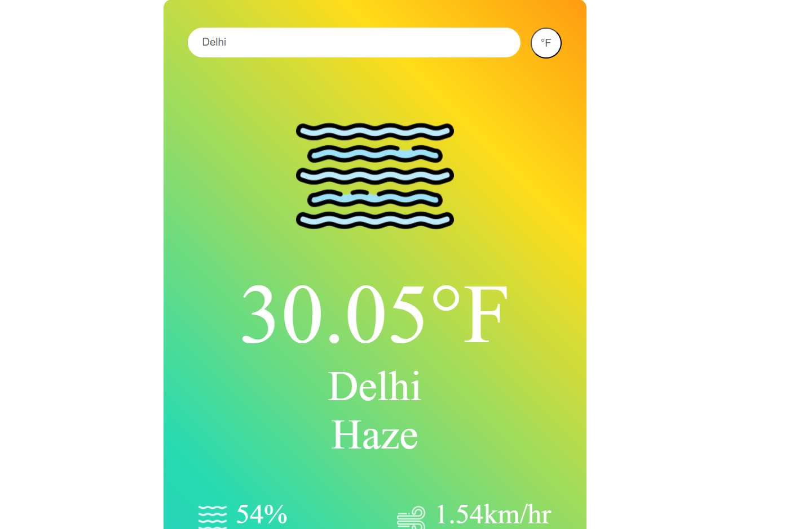

# Weather App

This is a simple weather app that allows you to check the weather for a specific location as you type and toggle between Celsius and Fahrenheit temperature units.

#Screenshot

# Features

Real-time weather data updates as you type a location.

Toggle between Celsius and Fahrenheit temperature units.

Automatically fetches weather data from the OpenWeatherMap API.

Dynamic Weather icon update on the basis of weather status.

Different error messages for different errors.

# Technologies Used

React.js

OpenWeatherMap API

# Getting Started 

This project was bootstrapped with [Create React App](https://github.com/facebook/create-react-app).

## Clone the repository to your local machine
git clone https://github.com/Shivam3263/weather-app.git

## Change directory to the project folder:
cd weather-app

## Install the required dependencies:
npm install

## Start the development server:
npm start

Open your browser and visit [http://localhost:3000] to use the weather app.

# Usage

As you type a location in the input field, the app will automatically fetch and display the current weather data for the specified location in real-time.

Toggle between Celsius and Fahrenheit units by clicking the "°C/°F" button which also changes dynamically accordingly to the temprature unit currently displayed.

# API Configuration

This app uses the OpenWeatherMap API to fetch weather data. To use your own API key, follow these steps:

Sign up for a free API key at OpenWeatherMap.

Replace the API key in the fetchAPI function inside the WeatherApp.jsx file with your own API key:
const URL = `https://api.openweathermap.org/data/2.5/weather?q=${search}&appid=YOUR_API_KEY&units=${units}`;

# Contributing
Contributions are welcome! If you'd like to contribute to this project, please follow these guidelines:

Fork the repository on GitHub.

Clone your forked repository to your local machine.

Create a new branch for your feature or bug fix.

Make your changes and commit them with descriptive commit messages.

Push your changes to your forked repository.

Create a pull request to merge your changes into the main repository.

# License
This project is licensed under the MIT License - see the LICENSE.md file for details.

# Acknowledgments
Thanks to the creators of React.js for providing a powerful framework for building web applications.

Special thanks to OpenWeatherMap for providing the weather data API.

# created by
Shivam Rawat
